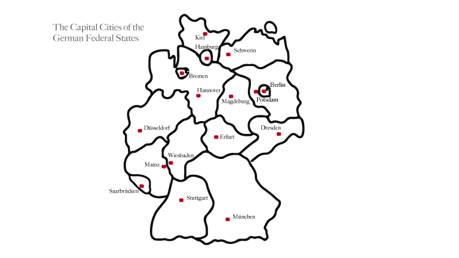
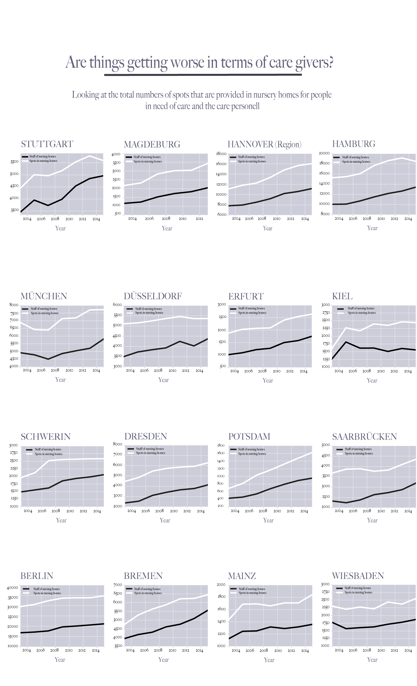
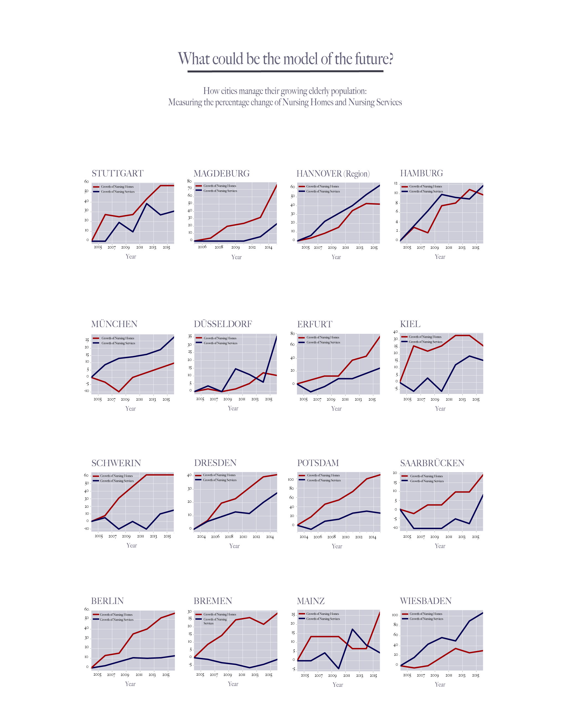

# How German Cities organize their aging Population

----------------------------------------

### by Elisa Harlan

The Germans die out. This is one of the most repeated sentences in news articles about the demographical change that goes on right now in Germany. Researchers and politicians are complaining about it since years. The aging structure in Germany is characterized by the fact that since 1972 the mortality rate is higher than the birth rate. This is not new, but due to the higher life expectancy of the population and at the same time a stagnating birth rate, the proportion of older people increases compared to younger people.

The influx of foreigners results in a small "rejuvenation effect" for the remaining population, but still, a balance is not yet to be reached. Therefore the care sector is steadily growing. 

This project wants to point out how big the increase in nursing homes and care services really is and whether it can serve the needs of the concerned group.
For this dataproject, I take a careful look at two claims that are publicly made since years, the first is:
"Germany suffers from a nursing crisis. There are less and less nurses that care for older people and the situation is getting worse".
Taking a look at the 16 capital cities of the Federal States, the "Bundesländer", we can see that in fact, the personnel and the spots in nursery homes grow all-in-all steadily and in most cities in a parallel way. 

When exmining the data, one has to keep in mind several restrictions: Firstly, it is not displayed how the newly employed personnel is qualified for the job. Secondly, it is a fact that if people get older, they suffer from multiple illnesses at the same time. In addition, dementia and alzheimer are more common nowadays. Caring for people with several illnesses is more time intensive and might emphasize the impression of staff shortage.

The second "wisdom" that is constantly repeated, is that care must be organised differently in the future. It seems that it is more and more unpopular that people decide to spend their time in nursery homes. Also, Families want to look after their elderly at home, but at the same time they don't want to give up their independece and their jobs to look after them. Since roughly 20 years it is getting more and more popular to have a nurse or a similarily trained person at home. The families who can afford it, pay between 2000 and 6000 Euros per month for these care givers, either directly or through an agency. The care giver is there for the old person 24 hours a day. Those persons are mostly women, coming from Eastern European countries.

The option that is somehow in between are the so-called nursery services, mainly provided by the Christian welfare and social work organizations. These nurses come by everyday and help with serving food, bathing and giving injections. 
As we can see from the chart, in some cities, the nursery services are growing a lot, some cities seem to put emphasize on developing new nursery homes. 
This could be the starting point of more research on how cities handle their aging population and what concepts they provide. 

----------------------------------------

Please check out the data sources for this project: 
[Regionalstatistik - Pflege in Deutschland](https://www.regionalstatistik.de/genesis/online;jsessionid=810ED86C52BC37DAB3BDDAEF3AFC7CF4.reg3?sequenz=statistikTabellen&selectionname=22411)

