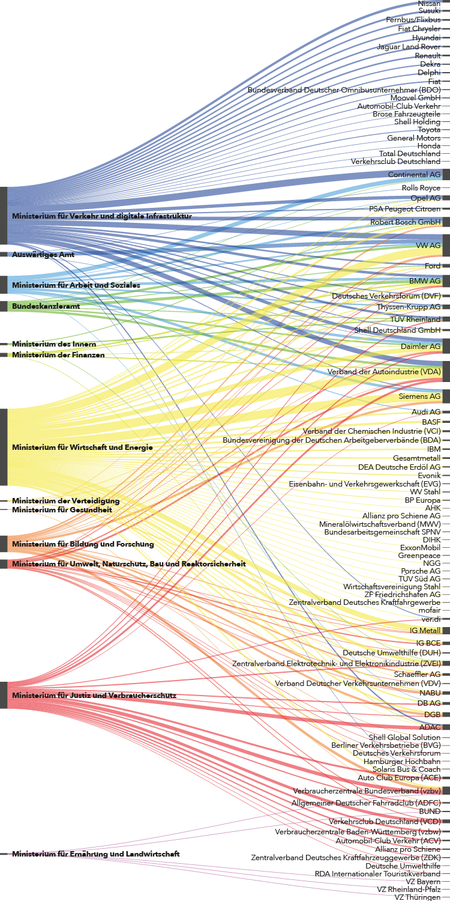
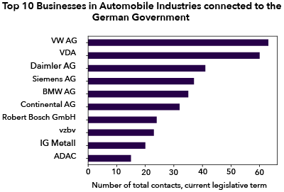
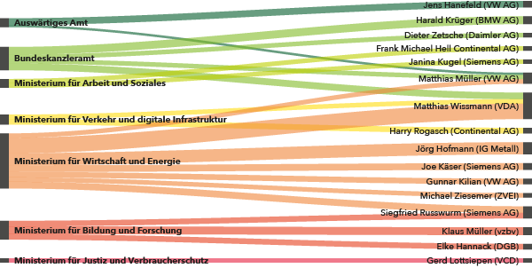
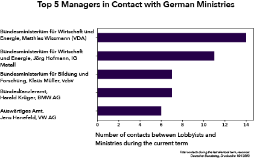
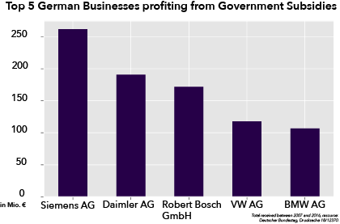
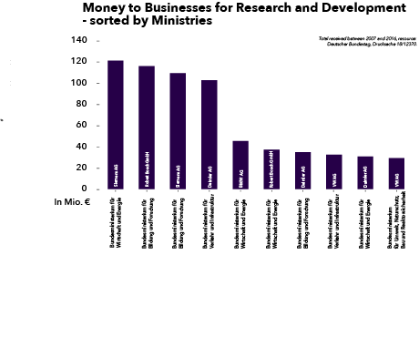

## The cozy relation between the German Carindustry and the Government

Emmissions rigging and the accusation of forming a cartel seem to only be the tip of the iceberg of close links in Germany’s car industry. The weekly magazine "DER SPIEGEL" recently disclosed that automotive companies regularly discussed their manipulations with each other. As a result the manufacturers are threatening cartel procedures and new billions of penalty in both the US and the EU Commission. 

The most current case in the history of industry-related affairs is about Stephan Weil, the Lower Saxony Minister President who gave one of his speeches to Volkswagen in advance. The topic: the emission scandal. Only for legal examination, he claims. 

This is not the only incident which shows that the links between politics and the automobile industry in Germany are too narrow. Effective control does not take place because many politicians feel responsible for securing jobs in their constituencies. And there are many: More than 800.000 jobs depend directly or indirectly on the car industry.

The figure below shows the contacts between German businesses that either make their money with cars or are automotive suppliers. Further displayed are contacts with the labour unions, such as IG Metall that represent the employees of the metal, electrical and steel sector. This is also important to investigate which other actors that are involved in the sector, are able to articulate their interests in transport policy.
 

Many processes in transport policy raise the question of the influence of the automobile industry and other actors on politics. As the party DIE LINKE writes in its "Kleine Anfrage", this reaches from the expansion of the public transport sector as a public-private partnership (PPP) to the negotiations on the reduction of CO2 values ​​for vehicles at European level. The discussion of greenhouse gas and pollutant emissions from motor vehicles is of great public interest in particular, especially in cities like Stuttgart, where particulate matters regularly hit the threshold that was set by the European Union.

To melt down the manifold relationships and focus on the ten most frequent contacts, Volkswagen (VW AG) played a prominent role in interacting with the ministries with slightly more than 60 contacts in the current legislative turn. Volkswagen is the largest European automotive manufacturer and holds the top position world wide together with Toyota and General Motors. 

Looking at the personal level, some prominent figures in the sector do especially often visit the German ministries. The Top 5-Manager that are personally in contact with the German government are shown below. Only managers that were in contact with the ministries at least four times are displayed the diagram. 

As one can see, one of the most bustling figures is Matthias Wissmann who is the president of VDA, the powerful "Verband der Automobilindustrie". On the last summit that was held because of the Diesel scandal in the beginning of August, Wissmann said: "All participants agree to avoid driving bans and want to make a massive contribution to improving air quality in German cities. It is clear to us as industry that trust was damaged and we admit that we are responsible for it." He assures the audience that the German carmakers that are concerned will offer a software update to their customers to improve airquality. 

The summit was highly critisized for being too vague about the concrete measures that shall be taken with regard to reduce the air pollution in German cities. 
This vagueness has a long tradition in Germany: In March 2015 the Federal Government quickly changed its attitude to more stringent EU abatement tests. Among others, the former Minister of Transport and today's VDA boss Matthias Wissmann intervened. In the end, the government passed a concrete date for the introduction of the tests and made significant concessions with regard to the manufacturers.

The figure below also just melts down the data that was shown before in order to show the exact number of the Top 5 interactions between the managers and the government. 

The second part of the project deals with subsidies that German carmakers receive from the Government for different purposes. A significant part of the money goes to "Research and Development" or "General Investment".
At least in the present documents (for sources, see link below) published by the government it does not become entirely clear into which projects the money goes to. 

As expected, the most money is distributed by the Federal Ministry for Economic Affairs and Energy, followed closely by the Ministry for Education and Science. 

As the barchart below is indicating, big players, like Siemens and Daimler are profiting the most from those kind of subsidies. During the last years, Siemens was able to receive more than 250 Mio. Euro from the government for research purposes. 

Looking at how the ministries distribute their money, it can be seen that some ministries favor certain companies. 

The data used for this project is extracted from two so-called "Kleine Anfrage". Opposition parties in the parliament do have the option to write requests to the government to which the government is obliged to answer in a certain time span. 

Please find the links here: 
[Kleine Anfrage - Kontakte der Bundesregierung zur Automobilindustrie](http://dip21.bundestag.de/dip21/btd/18/128/1812880.pdf)

[Kleine Anfrage - Subventionen an die Automobilindustrie](http://dip21.bundestag.de/dip21/btd/18/123/1812370.pdf)

