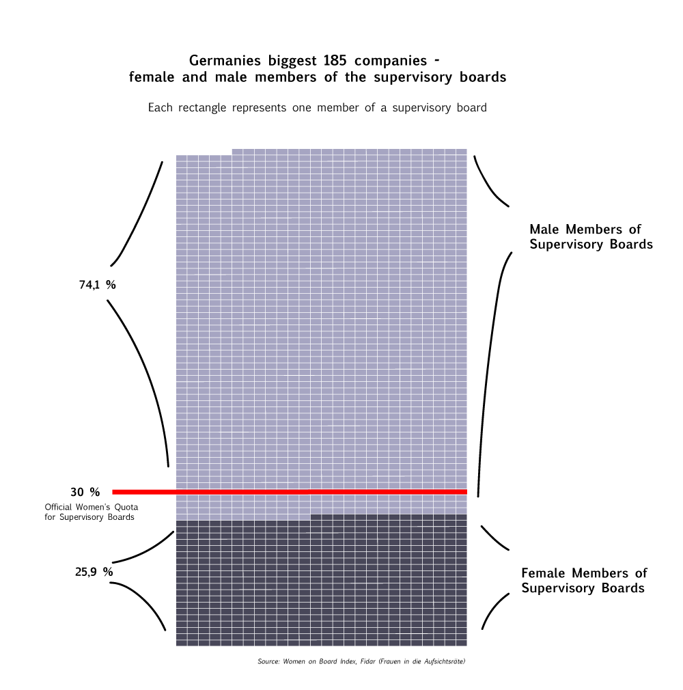
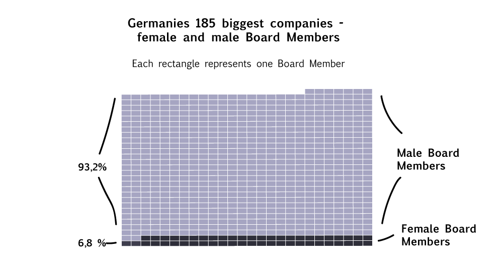

# No Women on Board

----------------------------------------

### by Elisa Harlan

Around two years after the introduction of a statutory women's quota for the private sector, women's share in management positions has risen slightly. This is the result of a joint report by the Ministry of Family Affairs and the Ministry of Justice. 
However, the paper says, there is still a "significant need for improvement" in the executive management to be noted.

The controversial law came into effect in May 2015. It had committed around 100 stock-listed, large-scale corporations to a fixed women's quota of 30 percent in the supervisory boards since the beginning of 2016. Taking into account the biggest 185 companies, the share of women in the supervisory board is 25.9 percent.

As the German newspaper "FAZ" writes, the Minister for Family Affairs, Katarina Barley (SPD), promptly gave the German economy an ultimatum to provide more women to become actual board members. Board members are a group of people who jointly oversee the activities of an organization. They make decisions with a large scope. Also for daily businesses they are very important. In comparison, the supervisory board promotes the companies interests through the governance of the company and holds more of an advisory role.
Minister Barley was very clear about the increasing the number of board members: "I give it another year to settle the matter itself. If nothing happens, we will intervene a law". She continues: "We have been able to observe for decades that self-commitments do not work."

In the case of board members, companies are currently free to decide which quota they want to meet. Many companies have so far indicated zero as the target value. "There has been almost nothing happening on the boards," Barley criticized. "Just six percent of the board members are female. That should not go on like this."

----------------------------------------

Please find the relevant documents here: 
[Women on Board Index](https://www.fidar.de/wob-indizes-und-studien/wob-index-185/aufsichtsrat-und-vorstand.html)

